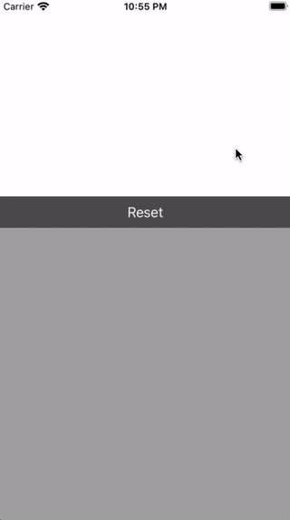

# MQHandwritingRecognition

基于系统库实现的汉字单字手写识别。

虽然`Vision`内的`VNRecognizeTextRequest`已经提供了文字识别方法, 但遇到单字后直接抓瞎。本想集成外置模型直接摆烂, 但是

>阿库娅大人说: "阿库西斯教徒都是努力的人, 就算失败了也是世界的错！遇到困难先跑路, 大不了弃坑。"
>
>我老婆说: "我讨厌的事有三件『办不到、好累、好麻烦』这三句话非常不好, 会抹杀人类所拥有的无限可能。"
>


手动增强后就能骗过阈值, 获取识别结果。

相对内置的手写输入法, 能抵抗乱序笔顺。




## 使用方法

### 识别用例

```swift
import MQHandwritingRecognition

let strokes = [[CGPoint]]()
let arr: [String] = await byRecognition(strokes: strokes)
print(arr)
```

strokes为笔画path, 具体可参考demo


### 配置相关

```swift
public struct Config {
    
    public static var edge: CGFloat = 200
    public static var padding: CGFloat = 20
    public static var lineWidth: CGFloat = 12
    
    public static var suffixArr = ["一", "三", "五"]
    public static var convDic = [
        "-": "一",
        "—": "一",
        "=": "二",
        "•": "",
    ]
}
```

`edge`, `padding`, `lineWidth`为生成增强后图像时相关间距参数。`suffixArr`为增强时的额外文字填充。`convDic`为识别结果纠错。


## 调用需求

- iOS14+

  `VNRecognizeTextRequestRevision1`仅支持英文

  `VNRecognizeTextRequestRevision2`支持中文, 但14才加入

  `VNRecognizeTextRequestRevision3`在现有增强策略下识别效果有问题, 因此手动指定revision2

